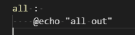
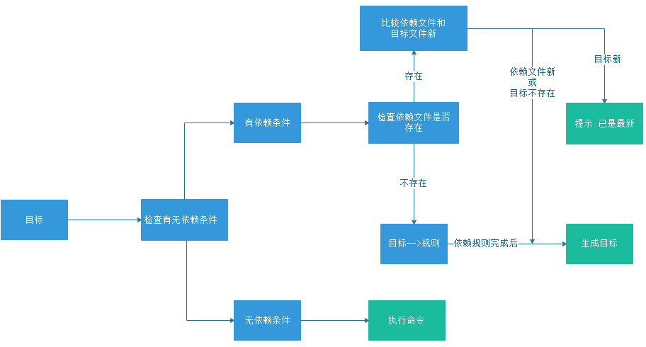
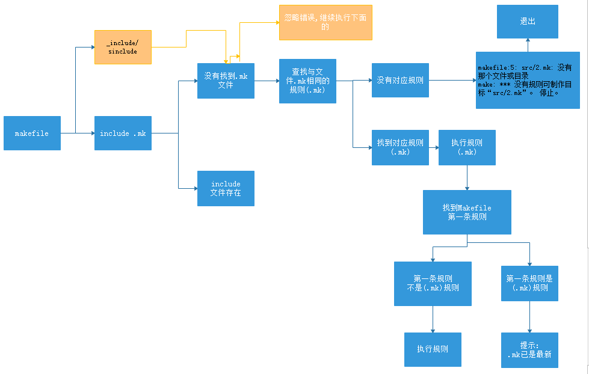
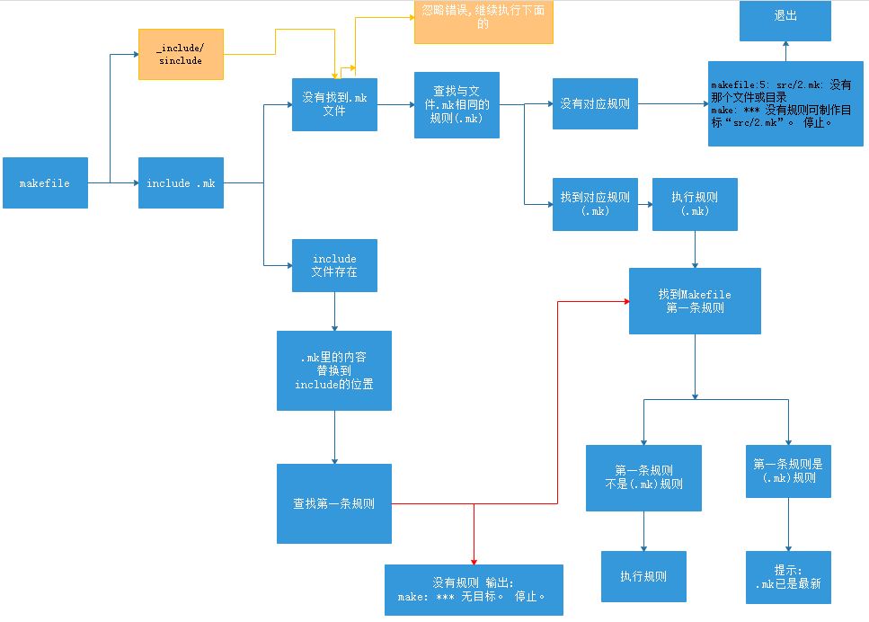

## makefile详细TL教程
本文章是从各个博客及书籍整理而来的,从一个个小示例,从而完成.自动化编译整个项目.

参考书籍: GNU_makefile中文手册,跟我一起写Makefile

make 是一个程序,它的功能是解释makefile文件的命令工具,只需要make一下,就完成整个项目的编译.

makefile是一个描述文件,定义一系列规则,make 根据makefile中规则执行命,令最终完成编译输出

### 基本规则
规则组成:
目标: 要生成的目标文件
依赖: 目标文件要依赖哪些文件
命令: 命令执行

语法如下:
```
目标 : 依赖
\t 命令
```

```
例子1: 02/01_01
在空白文件夹创建makefile文件
====================
# #:代表注释
# make 会直接直接 调用顶层的第一条 规则
# 规则1
all : test1
	@echo "all out"
====================

root@fjs:~/code/fjs/makefile/02/01_01# make
all out

解释: 
在终端上输入make后, make程序会进行解析makefile文件,首先会找到顶层的规则进行执行.

那么什么是规则 :  
由[xxx : xxx ]或[(空格符)  xxx : xxx]组成, 前面有空格符或者顶头写的这种,便是规则

上面的makefile 如:
这一行便是规则  [all : ]
all目标,它的依赖为空,即没有依赖.那么就会执行下面的命令
echo "all out" 这条shell命令,便是输出了

```

例子2: 02/01_01_01

有人会说,这么写很简单呀.但是需要认真对待,比如这个例子,直接make,出现了错误.
```
all : 
    @echo "all out"
```

```
root@fjs:~/code/fjs/makefile/02/01_01_01# make
makefile:6: *** 遗漏分隔符 (null)。 停止。
```



原因是你把这里的tab键,变成了空格,有些软件会自动把tab键变成空格的,如vscode.需要先设置一下的.

例子3:

```
all : 
	@echo "all out"

test1 : 
	@echo "test1 out"

test2 : 
	@echo "test2 out"
```

```
发现有三条规则 :
all : 
test1 : 
test2 : 

那么 在终端上 make 目标,操作如下,便会发现make 每个目标,便会执行不同的目标下的命令

root@fjs:~/code/fjs/makefile/02/01_02# make
all out
root@fjs:~/code/fjs/makefile/02/01_02# make all
all out
root@fjs:~/code/fjs/makefile/02/01_02# make test1
test1 out
root@fjs:~/code/fjs/makefile/02/01_02# make test2
test2 out

```

有人会发现	@echo "test2 out" 这个@作用什么呢?

如例子02/01_02_01 中,咱们all中@符去掉,输入make all.

便会发现先输出一行待执行的指令,下面才是执行结果,@符可以忽略这条指令显示,命令无回显
```
root@fjs:~/code/fjs/makefile/02/01_02_01# make all
echo "all out"
all out
```

例子4: 02/01_02_02

```
all : 

test1 : test2
	@echo "test1 out"
test2 : 
	@echo "test2 out"
```

```
此时make 去执行all目标规则时,便会发现没有依赖,就去执行命令,此时没有命令,则会提示无需做任何事
root@fjs:~/code/fjs/makefile/02/01_02_02# make all
make: 对“all”无需做任何事。

此时make 去执行test2目标规则时,便会发现没有依赖,就去执行命令.

root@fjs:~/code/fjs/makefile/02/01_02_02# make test2
test2 out

此时呢,make test1,就去查找test1的目标规则,发现有依赖test2, 就去执行test2的目标,并执行test2的命令后,此时依赖已经执行完成了.
再去执行test1的命令

root@fjs:~/code/fjs/makefile/02/01_02_02# make test1
test2 out
test1 out
```

综上:
- 目标可以有多个,即多目标
- 依赖可以没有
- 命令也可以没有

如果你不写目标,那等于白写,没有啥作用
```
:test2
	@echo "test2 out"
``

例子4: 02/01_02_02

```
```
all : 

test1 : 
	@echo "test1 out"
test1 : 
	@echo "test1_1 out"

test2 : 
	@echo "test2 out"
test2 : test3
	@echo "test2_2 out"

test3:
	@echo "test3 out"
	
test4 : test5
test4 : test6
	@echo "test4_4 out"

test5 :
	@echo "test5 out"

test6 :
	@echo "test6 out"

```

```
下面make test1 和make test2时,会发现警告.
root@fjs:~/code/fjs/makefile/02/01_02_03# make test1
makefile:6: 警告：覆盖关于目标“test1”的配方
makefile:4: 警告：忽略关于目标“test1”的旧配方
makefile:11: 警告：覆盖关于目标“test2”的配方
makefile:9: 警告：忽略关于目标“test2”的旧配方
test1_1 out

root@fjs:~/code/fjs/makefile/02/01_02_03# make test2
makefile:6: 警告：覆盖关于目标“test1”的配方
makefile:4: 警告：忽略关于目标“test1”的旧配方
makefile:11: 警告：覆盖关于目标“test2”的配方
makefile:9: 警告：忽略关于目标“test2”的旧配方
test3 out
test2_2 out

make test1 会输出 test1_1 out,说明两条test1相同的规则,则会执行下面的test1规则,
相当于把上面的规则给替换了

make test2时, 发现也是执行目标的下面的命令.

那么咱们把 两条规则交换一下,把依赖test3放在上面
test2 : test3
	@echo "test2_2 out"
test2 : 
	@echo "test2 out"

则输出:
root@fjs:~/code/fjs/makefile/02/01_02_03# make test2
makefile:6: 警告：覆盖关于目标“test1”的配方
makefile:4: 警告：忽略关于目标“test1”的旧配方
makefile:12: 警告：覆盖关于目标“test2”的配方
makefile:10: 警告：忽略关于目标“test2”的旧配方
test3 out
test2 out

这说明了什么? 相同规则多处定义,依赖合并,命令则替换为最后一次出现的

于是乎,咱们写出来了 下面的依赖关系会如何执行呢?
test4 : test5
test4 : test6

输出结果
root@fjs:~/code/fjs/makefile/02/01_02_03# make test4
test6 out
test5 out
test4_4 out

那么会发现,一个目标,依赖于多个.那么应该可以合并.
test4 : test5
test4 : test6
这两行合并成一行, 下面的test6 在test5前面,先依赖test6,再依赖test5

test4 : test6 test5
```

总结: 相同规则多处定义,依赖合并,命令则替换为最后一次的命令

### make 的依赖原则

要想生成 规则中的目标,先检查规则中的所有的依赖文件是否都存在.

生成目标-->检查依赖文件是否存在

依赖文件不存在-->直接执行命令-->命令生成目标文件或执行其他的目标文件

如果依赖文件存在 --> 则比较目标与依赖文件谁新,按照时间戳,最新创建的时间则最新



下面来演示 : 目标和依赖的关系

```
实际上,目标和依赖其实都是文件,文件存在了

01_02_04
=====================
all : test1
	@touch all
	@echo "touch all file ok"

test1 : 
	@touch test1
	@echo "touch test1 file ok"
=====================

out make 两次输出,
1. 第一次make,会找第一条的规则,发现all有依赖目标,就去查找依赖文件是否存在,
2. 此时发现依赖文件不存在,则去执行依赖变成目标的规则了test1 : ...
3. 此时,命令是生成一个test1目标文件. 依赖完成后,就去执行all的命令.
4. 就会生成all文件

第2次执行,发现依赖文件存在,就不用执行依赖为目标的命令了, 那么就该生成目标文件了.
目标存在,就去比较目标文件和依赖文件,谁的时间晚,发现依赖文件先创建,目标文件后创建,
则不会执行all目标的命令了.提示all已是最新了

root@fjs:~/code/fjs/makefile/02/01_02_04# make
touch test1 file ok
touch all file ok
root@fjs:~/code/fjs/makefile/02/01_02_04# make
make: “all”已是最新。

此时: 先把目标all文件删除了,执行make,all 目标不存在了则会执行all的相关命令.
root@fjs:~/code/fjs/makefile/02/01_02_04# rm all
root@fjs:~/code/fjs/makefile/02/01_02_04# make
touch all file ok

此时: 删除test1文件,执行make 发现依赖不存在,则执行依赖命令,创建test1依赖目标
all目标文件存在,比较test1和all的创建时间,发现依赖的时间新,则去执行all的命令

root@fjs:~/code/fjs/makefile/02/01_02_04# rm test1 
root@fjs:~/code/fjs/makefile/02/01_02_04# make
touch test1 file ok
touch all file ok
```

### 伪目标

伪目标是什么鬼?

02/01_02_05
```
all : 
	@touch all
	@echo "touch all file ok"
```

```
先执行make,就去查找第一条规则,all没有依赖,就去查找all有没有文件存在,发现本地并没有all文件
则去执行all中的命令
第二次make,发现all目标存在,则不再需要执行命令了.
out :
root@fjs:~/code/fjs/makefile/02/01_02_05# make
touch all file ok
root@fjs:~/code/fjs/makefile/02/01_02_05# make
make: “all”已是最新。

此时,我们想执行 make all,发现 已是最新,有个想法,我每次执行make all,
都要make程序去执行这条命令.

此时就要把all 变成伪目标了
```

例子 : 02/01_02_06

```

.PHONY : all

all : 
	@touch all
	@echo "touch all file ok"
```
```
此时发现两次make,都会去执行all中的命令, all现在便是伪目标了,
不再关心本地是否有文件是否存在了

root@fjs:~/code/fjs/makefile/02/01_02_06# make
touch all file ok
root@fjs:~/code/fjs/makefile/02/01_02_06# make
touch all file ok
```

伪目标: .PHONY 关键字声明一个伪目标

语法:
```
.PHONY : xxx

xxx :
```

### 变量

makefile的变量是字符串

规则: 字符字母下划线,不能包含: # " " 变量名大小写敏感

那么如何赋值呢?

变量赋值 := 

追加赋值：+=

如 test1 := hello

取出变量的值 $(test1)

02/01_02_07
```
.PHONY : all

version := 1.0.1

test1 := $(version)
test2 :=
test3 :=
test3 += $(version)
test4 := hello
test4 += 9.999
all :
	@echo "version : [$(version)]"
	@echo "test1 : [$(test1)]"
	@echo "test2 : [$(test2)]"
	@echo "test3 : [$(test3)]"
	@echo "test4 : [$(test4)]"
```

```
执行后,test2 := ;会默认为空值;test4 += 9.999 则是把两个串连接起来,加空格隔开
root@fjs:~/code/fjs/makefile/02/01_02_07# make
version : [1.0.1]
test1 : [1.0.1]
test2 : []
test3 : [ 1.0.1]
test4 : [hello 9.999]
```

### 模式匹配

模式替换:使用%保留变量值中的指定字符串,替换成其他字符串

变量模式替换:

语法格式: $(var:a%b=x%y) ,变量替换表达式中不能任何的空格

规则模式替换:

%x : %y  
    @cmd
比如 某规则(hellox)开始执行 然后去匹配 目标是不是以x结尾的.

如果是x结尾的,则把目标(hellox)的替换为y(helloy),进行充当依赖. 把helloy 当成目标规则,再次匹配

$@ : 是规则中目标
@^ : 是所有依赖
@< : 是第一个依赖

转义: 比如在echo中输出$@字符 :添加\$ 进行转义,如 \$$

例子01_03_01
```
var := defTESTabc
var1 := $(var:def%abc=x%y)
var2 := $(var:%bc=%y)

all :
	@echo "var : [$(var)]"
	@echo "var1 : [$(var1)]"
	@echo "var2 : [$(var2)]"

	@echo "all out"
```

```
$(var) 是取出变量的值 
$(var:def%abc=x%y) :
%的左边要匹配变量开头的字符def,与%右边的字符abc中间的字符保持不变.
把def 替换为 x; abc 替换为y

var2 : 只是匹配最后的字符,然后进行替换

out
root@fjs:~/code/fjs/makefile/02/01_03_01# make all
var : [defTESTabc]
var1 : [xTESTy]
var2 : [defTESTay]
all out
```

```
test2 : t1 t2 t3
	@echo "test2 build: "
	@echo "\$$@ : [$@]"
	@echo "\$$^ : [$^]"
	@echo "\$$< : [$<]"

t1 t2 t3 :
		@echo "build \$$@ : [$@]"
```
```
t1 t2 t3 : 为规则中的多目标,同一时间只能够匹配一个
可以看出$@ $^ $< 匹配的是什么东西了 

root@fjs:~/code/fjs/makefile/02/01_03_01# make test2
build $@ : [t1]
build $@ : [t2]
build $@ : [t3]
test2 build: 
$@ : [test2]
$^ : [t1 t2 t3]
$< : [t1]
```


例子01_03_01 test3
```
%x: %y
	@echo "\$$@ : [$@]"
	@echo "\$$^ : [$^]"

%y : 
	@echo "[$@]"
```

```
在终端上输入make 以x结尾的字符串. make hellox;只有以x为结尾的目标,
才能够匹配 %x: %y 这条规则 %y 则被替换为helloy.也就是末尾的字符相互替换.
前边的不变.先去执行helloy的规则,完成再去执行hellox的命令

out
root@fjs:~/code/fjs/makefile/02/01_03_01# make hellox
[helloy]
$@ : [hellox]
$^ : [helloy]
```
例子01_03_01 test4
```
out := a.a b.a c.a

$(out) : %.a : %.b
	@echo "\$$@ : [$@]"
	@echo "\$$^ : [$^]"

%.b : 
	@echo "[$@]"
```

```
规则模式匹配,其实还有变形,我随便输入一个以某字符串结尾的,
都能够匹配到这条命令, 有人想,可不可以只是从我输入固定的几个值中,
去匹配这个规则.

这便是下面的,从out 变量中,存了几个字符串,然后去匹配,不属于out变量的值
便不匹配了.

root@fjs:~/code/fjs/makefile/02/01_03_01# make b.a
[b.b]
$@ : [b.a]
$^ : [b.b]
root@fjs:~/code/fjs/makefile/02/01_03_01# make d.a
make: *** 没有规则可制作目标“d.a”。 停止。
```


override 关键字

用于指示makefile中定义的变量不能被覆盖,
一般所有定义的变量咱们都不允许被修改,

例子01_03_01 test4
```
t5 := t5555
t6 :=
override t7 := t7777
test5:
	@echo "t5 : $(t5)"
	@echo "t6 : $(t6)"
	@echo "t7 : $(t7)"
```

```
在终端上make 传入参数,即值被修改,override 关键字则不能被修改

root@fjs:~/code/fjs/makefile/02/01_03_01# make test5 t6:=1100 t7:=1000
t5 : t5555
t6 : 1100
t7 : t7777
```
### 条件判断
```
ifeq 判断参数是否相等, 相等为true,否 false
ifneq 是否不相等,不相等为true 否则为false
ifdef 变量是否有值,有值为true,否则为false
ifndef 判断变量是否没有值,没有值为true 否则为false
```
一般咱们会用ifeq 进行判断 是否相等

```
debug := true
var := 100
ifeq ($(debug),true)
	var := 1000
else
	var := 0
endif

test1 :
ifeq ($(debug),true)
	@echo "debug : [$(debug)] == true"
	@echo "var : = [$(var)]"
else 
	@echo "debug : [$(debug)] != true"
	@echo "var : = [$(var)]"
endif

test2 :
    ifeq ($(debug),true1)
		@echo "debug : [$(debug)] == true"
    else 
		@echo "debug : [$(debug)] != true"
    endif
```
```
注意的是.ifeq可以用在规则内,也可以使用在规则外.如果在规则内的话
,添加4个空格

root@fjs:~/code/fjs/makefile/02/01_03_02# make test1
debug : [true] == true
var : = [1000]
root@fjs:~/code/fjs/makefile/02/01_03_02# make test2
debug : [true] != true
```

### 自定义函数

在makefile中支持自定义函数实现,并调用执行

通过define 关键字实现自定义函数

自定义函数:是过程调用,没有任何的返回值.

自定义函数用于应用于规则中

如果参数不存在,则为空,通过call,调用函数来实现.

自定义函数调用格式: $(call 函数名,参数1,参数2)

内嵌函数格式 : $(函数名 参数1,参数2,参数3)

语法: 
```
define func1 
    @echo "func1 : [$(0)]"
endef

define func2 
  @echo "func1 is [$(0)]"
  @echo "Param is [$(1)]"
endef

函数调用
test :
    $(call func1)  
    $(call func2,aaa)
```

```
调用规则很简单
func1 : [func1]
func1 : [func2]
Param1 : [aaa]
Param2 : []
```

### 内嵌函数
- 文本处理函数
- 文件名处理函数
- ...其他函数

subst 函数
```
 $(subst FROM,TO,TEXT)
 subst函数 : 字符串替换函数
 功能: 把TEXT文本字符串中FROM替换为TO
```

```
var_subst := $(subst aaa,xxx,haaalaaalaaaloaaa)

all :
	@echo "var_subst : [$(var_subst)]"
	@echo "all out"

# out
# var_subst : [hxxxlxxxlxxxloxxx]
```

patsubst 函数进行模式替换

和 $(var:bbb%aaa=yyy%xxx)是相同的功能
```
比如,咱们可以使用其中一种来进行表达,把所有.o替换成.c
objects := a.o c.o d.o
$(objects:.o=.c) 
$(patsubst %.o,%.c,$(objects))
```
```
#var_patsubst : [yyylloxxx]
var := bbblloaaa
var_patsubst := $(patsubst bbb%aaa,yyy%xxx,$(var))
var_patsubst2 := $(var:bbb%aaa=yyy%xxx)

test2:
	@echo "var_patsubst : [$(var_patsubst)]"
	@echo "var_patsubst2 : [$(var_patsubst2)]"
```

strip 函数:去除空字符不可显示字符,然后使用单一空格分隔开来.

比如两个字符串中间原本是tab键,现在会把tab键去掉,在中间用空格隔开

```
var_strip := a       c ccdd	 	dd cc
var_strip2 := 	 a    c 	ccdd	dd    	cc	 

var_strip3 := $(strip $(var_strip))
var_strip4 := $(strip $(var_strip2))

test3:
	@echo "var_strip : [$(var_strip)]"
	@echo "var_strip2 : [$(var_strip2)]"
	@echo "var_strip3 : [$(var_strip3)]"
	@echo "var_strip4 : [$(var_strip4)]"

# var_subst : [hxxxlxxxlxxxloxxx]
# var_patsubst : [yyylloxxx]
# var_patsubst2 : [yyylloxxx]
# var_strip : [a       c ccdd             dd cc]
# var_strip2 : [a    c    ccdd    dd      cc       ]
# var_strip3 : [a c ccdd dd cc]
# var_strip4 : [a c ccdd dd cc]
```

findstring 函数 : 查找字符串,找到返回字符,找不到返回空
```
var_findstring := asdfgghjkl

var_findstring2 := $(findstring gg,$(var_findstring))
test4:
	@echo "var_findstring : [$(var_findstring)]"
	@echo "var_findstring2 : [$(var_findstring2)]"

# var_findstring : [asdfgghjkl]
# var_findstring2 : [gg]
```

filter 函数 :过滤掉模式不匹配的字符串,符合的留下. 常用

```
var_filter := a.c b.o c.d d.o f.c e.h
# 这里只是匹配a.c.直接写a.c不就好了,除非找不到a.c
# 没有多大实在意义
var_filter1 := $(filter a.c,$(var_filter))
var_filter2 := $(filter %.c %.o,$(var_filter))

test5:
	@echo "var_filter1 : [$(var_filter1)]"
	@echo "var_filter2 : [$(var_filter2)]"
	
# var_filter1 : [a.c]
# var_filter2 : [a.c b.o d.o f.c]

```

filter-out : 与filter 函数相反

```
比如串 : [a.c d.d f.e o.o ...], 我不想要a.c o.o ,其余的串都需要.
filter-out就可以实现这样的功能

var_filter_out := a.c d.d f.e o.o p.p c.s
var_filter_out1 := a.c o.o
var_filter_out2 := $(filter-out $(var_filter_out1),$(var_filter_out))

test5:
	@echo "var_filter_out : [$(var_filter_out)]"
	@echo "var_filter_out2 : [$(var_filter_out2)]"

# var_filter_out : [a.c d.d f.e o.o p.p c.s]
# var_filter_out2 : [d.d f.e p.p c.s]

```

sort 函数: 首字母排序并去除重复的串

```
var_sort := zzz ooo ccc ooo foo
var_sort1 := $(sort $(var_sort))
test6:
	@echo "var_sort1 : [$(var_sort1)]"

# var_sort1 : [ccc foo ooo zzz]
```

文件名处理函数:
suffix : 取后缀名,以.开头的
basename 函数 是取前缀的东西. 比如取个文件名
```
var_suffix := fggga.c eeec.c aae.o

var_suffix1 := $(suffix $(var_suffix))
var_basename := $(basename $(var_suffix))
test7:
	@echo "var_suffix1 : [$(var_suffix1)]"
	@echo "var_basename : [$(var_basename)]"

# var_suffix1 : [.c .c .o]
# var_basename : [fggga eeec aae]
```

addsuffix 函数是 增加后缀的
```
var_addsuffix := aaa bbb ccc ddd
var_addsuffix1 := $(addsuffix .h,$(var_addsuffix))
var_addprefix :=  $(addprefix g_,$(var_addsuffix))
test8:
	@echo "var_addsuffix1 : [$(var_addsuffix1)]"
	@echo "var_addprefix : [$(var_addprefix)]"

# var_addsuffix1 : [aaa.h bbb.h ccc.h ddd.h]
# var_addprefix : [g_aaa g_bbb g_ccc g_ddd]
```

wildcard : 遍历当前文件夹下的所有文件名

$(wildcard *.c)
```
var_files := $(wildcard *.c)
test8:
	@echo "var_files : [$(var_files)]"
# var_files : [a.c b.c]
```
```
注意是同一个规则下,去创建文件后,然后进行遍历,就会发现没有创建的
var_files := $(wildcard *.c)

define funcTest8 
	@touch a.c
	@touch b.c
	@echo "var_files : [$(var_files)] [$(wildcard *.c)]"
endef

test8:
	# rm -rf a.c b.c
	$(call funcTest8)
	@echo "var_files : [$(var_files)] [$(wildcard *.c)]"
# var_files : [a.c b.c]
```

错误退出

```
test9:
	@ $(warning warning exit)
	@ $(error error exit)
	@echo "test9 exit"
```

### make include 用法
make -f可以指定执行一个makefile文件

02/01_05_01
```
all:
	@echo "all exit"
```
```
root@fjs:~/code/fjs/makefile/02/01_05_01# make -f makefile1.mk 
all exit
```

include : 关键字,可以把其他的makefile文件包含进来.

语法: include <filename>  如 include a.make *.mk 

 如果没有找到include makefile文件时,会发生什么.找到文件了会怎么处理?
规则怎么进行处理?

1. 没有找到Makefile文件的情况
例子:02/01_05_02 : 里面的几个例子来进行探索

makefile1:
```
include 1.mk

 ```
 
 ```
 第1阶段就去查找1.mk文件,发现不存在时,就提示 1.mk: 没有那个文件或目录;
 但是下面就提示了一行没有规则可制作目标1.mk,简单看就是把1.mk当成了规则,然后去制作,就是去执行.
 
root@fjs:~/code/fjs/makefile/02/01_05_02# make -f makefile1
makefile1:1: 1.mk: 没有那个文件或目录
make: *** 没有规则可制作目标“1.mk”。 停止。
```

makefile11
```
include test1 test2 test3 

all: 
	@echo "all out"

test1 test2 test3 :
	@echo "$@ : out"
```

```
于是乎,咱们看到上面没有规则,可制作规则,那么,咱们便定义规则,看看会发生什么?
于是定义了三条规则,发现输出是进行压栈出栈顺序的,先包含的文件规则,最后被调用.

看输出,便明白了,先执行include,发现文件不存在,提示文件不存在,
再去(制作)执行对应规则

可是 为什么会提示? make: “test1”已是最新。

root@fjs:~/code/fjs/makefile/02/01_05_02# make -f makefile11
makefile11:1: test1: 没有那个文件或目录
makefile11:1: test2: 没有那个文件或目录
makefile11:1: test3: 没有那个文件或目录
test3 : out
test2 : out
test1 : out
make: “test1”已是最新。
```

makefile12
```
include test1

test1:
	@echo "$@ : out"

```

```
咱们上边包含了多个文件,看起来很复杂,于是咱们精简下.
先找文件-->文件不存在-->提示  没有那个文件或目录-->
执行规则 -->? make: “test1”已是最新

已是最新说明,又一次执行了此规则,为什么会执行?

make 执行步骤,会去找第一条的规则去执行. 那什么时候去找第一条规则呢???
就是把include指令执行完毕后,再去找. 在执行test1规则后,输出test1 : out后

便找到了第一条规则,发现第一条规则是test1. 因为test1在include执行过,
所以再去执行test1时,就提示已是最新

out
root@fjs:~/code/fjs/makefile/02/01_05_02# make -f makefile12
makefile12:1: test1: 没有那个文件或目录
test1 : out
make: “test1”已是最新

```


makefile13
```
include test1

all :
	@echo "all out"
	
test1:
	@echo "$@ : out"
```
```
有人想,我第一条规则不是test1会发生什么呢?
很显然 : 先去找文件,文件不存在提示--> test1: 没有那个文件或目录
-->去执行test1目标规则-->输出后-->include执行完毕
再去找第一条规则-->执行(输出 all out)

out
root@fjs:~/code/fjs/makefile/02/01_05_02# make -f makefile13
makefile13:1: test1: 没有那个文件或目录
test1 : out
all out
```

makefile2
```
all: 
	@echo "all out"

include 1.mk
```

```
也有人会脑洞打开,我把include指令放到最后,你是先执行第一条规则,
还是先执行include.
make的思路,肯定会解析makefile文件,先发现了第一条规则,陆陆续续的发现include
那么make会怎么处理??

通过测试,发现解析 makefile文件后,并不是立马处理第一条规则,先处理include相关的命令,发现找不到文件,并没有规则立马停止了.此时并没有到达第一条规则的地方. 

out
root@fjs:~/code/fjs/makefile/02/01_05_02# make -f makefile2
makefile2:4: 1.mk: 没有那个文件或目录
make: *** 没有规则可制作目标“1.mk”。 停止。
```

makefile21
```
all: 
	@echo "all out"

1.mk : 
	@echo "1.mk out"

include 1.mk
```

```
那么咱们把文件规则写上. 写在了第二条规则处,现在有了规则了,就应该执行了
-->找不到文件-->执行1.mk规则-->执行第一条规则

root@fjs:~/code/fjs/makefile/02/01_05_02# make -f makefile21
makefile21:8: 1.mk: 没有那个文件或目录
1.mk out
all out
```

makefile22
```
1.mk : 
	@echo "1.mk out"

all: 
	@echo "all out"

include 1.mk
```

```
root@fjs:~/code/fjs/makefile/02/01_05_02# make -f makefile22
makefile22:8: 1.mk: 没有那个文件或目录
1.mk out
make: “1.mk”已是最新。
```

总结:


```
makefile 中 出现include关键字时,先去找有没有此目标文件.
如果没有文件,便去找 此文件匹配的文件名规则. 找到,则执行此规则-->再去执行第一条规则.
-->如果第一条规则和此文件规则相同,则提示最新
```


如果include 文件 存在时
```
难免咱们会想几个问题,
1. 会有没有与文件相同的规则, 有的话,怎么执行. 
相同的文件规则放到文件里面和主makefile里面会有所不同体现吗?
文件规则放在最上边和放在第一条规则下面,会如何?
2. 文件里规则和主makefile的规则重复了  
3. 如果是变量重复了定义会怎么办.

那么纠结干啥子呢?所以尽量避免同名.有时也需要搞明白同名了会如何如何
下面咱们来写几个makefile进行测试一下
```

01_05_03
```
makefile:

include 1.mk

all:
	@echo "all out"

1.mk : 文件为空
```
```
-->include 文件 存在-->便把文件里的内容替换到include的位置. 
合并后,然后进行解析makefile,查找第一条规则.并执行

out
root@fjs:~/code/fjs/makefile/02/01_05_03# make
all out
```

现在通过01_05_04里面的例子来验证上面的结论,把内容替换到include的位置
```
1.mk 文件: 

test1 :
	@echo "$@  out"

makefile1:

include 1.mk

all:
	@echo "all out"

makefile2 :

all:
	@echo "all out"
	
include 1.mk

```

```
include 的位置,分别放在了第一条规则的前边和后边

makefile1 : 替换后的内容是
//--------
test1 :
	@echo "$@  out"
all:
	@echo "all out"
//--------

所以第一条规则是test1,故执行了,

makefile2 替换后,第一条规则是all,故all先执行了

root@fjs:~/code/fjs/makefile/02/01_05_04# make -f makefile1
test1  out
root@fjs:~/code/fjs/makefile/02/01_05_04# make -f makefile2
all out

```

```
如果把 1.mk 作为规则放进去呢?
01_05_05 :
1.mk 文件内容:

1.mk :
	@echo "$@  out"

```

```
便可以发现,去执行makefile1 时,出现提示“1.mk”已是最新. 
当然:你把1.mk作为第一条规则,无论是放到1.mk里面,还是主makefile1文件里.
比如主文件里面 位置1和位置2.都可以出现下面的提示
# 位置1
#1.mk :
#	@echo "$@  out"
include 1.mk
#位置2
#1.mk :
#	@echo "$@  out"

all:
	@echo "all out"

其实理解起来很简单的,怎么理解呢?当你include完成时
是不是1.mk文件就是最新的,然后就去执行第一条规则,
发现第一条规则是1.mk时,就去有没有1.mk这个文件存在,
就去比较规则和文件时间新的问题.此时是最新的.那么就提示已是最新.
如果不理解就看下一个小例子,你就明白了

out
root@fjs:~/code/fjs/makefile/02/01_05_05# make -f makefile1
make: “1.mk”已是最新。
root@fjs:~/code/fjs/makefile/02/01_05_05# make -f makefile2
all out
```

01_05_06

```
all : 
	@echo "all out"
```

```
创建了与规则中的目标相同的文件时,就会提示已是最新.
简单讲:
规则中的目标不存在时,就会生成(去执行规则中的命令)
如果目标存在时,就会比较与依赖谁更新,发现没有依赖,故目标是最新的.
就不需要执行了.

root@fjs:~/code/fjs/makefile/02/01_05_06# make
all out
root@fjs:~/code/fjs/makefile/02/01_05_06# touch all
root@fjs:~/code/fjs/makefile/02/01_05_06# make
make: “all”已是最新。
root@fjs:~/code/fjs/makefile/02/01_05_06# ls
all  makefile
```



```
如果规则重名了, 就把文件内容替换后,再结合以前的多目标规则等等,
加以理解便可以了,难度并不大.

```